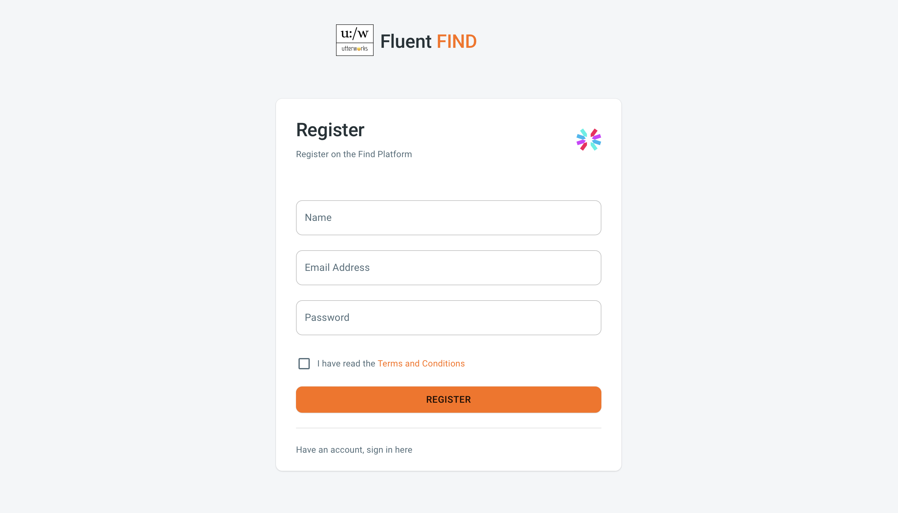
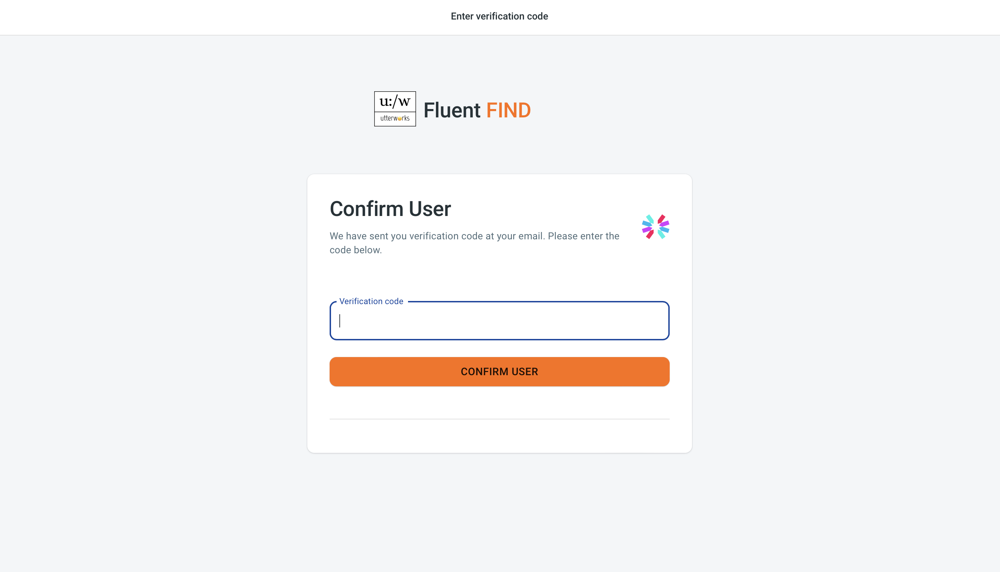

# Register
From the main landing page select register in the top right

## Sign Up
The registration process requires a name, an email address and then you need to set a password. 
> N.B Your password must be at least 8 characters long and contain a mix of upper and lower case letters, numbers and other characters. You will also need to agree to the terms of service

Once you have successfully registered you will receive a verification code at the email address you registered with, it will be sent to you from admin@utterworks.com. Sign in with the credentials you have just created and then enter the verification code as prompted.

Congratulations, you are now signed in and ready to create your first search App :joy: