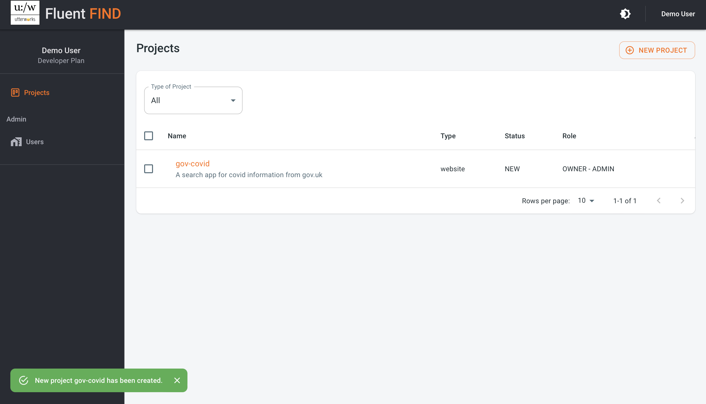

# Create a Search Project
From the landing page, select Indexes from the menu bar top right to get started

 

Create a new search project using the add new project buttom

Enter a project name..  
>The name should be a max of 10 characters - with no spaces, a mix of lowercase letters, numbers and hyphens are allowed - this will be the reference used for the app in the API.

Next, provide a meaningful title, and then select the source for the content to be indexed. This can be either a website (to crawl or configure a sitemap), or an AWS S3 bucket.

Once all the information is provided, use the Create button to create the new project. You'll then be taken to the projects view where you'll see the new project alongside any existing projects

