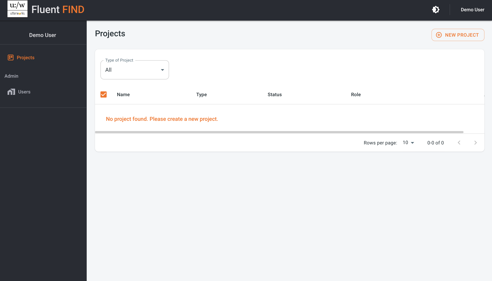
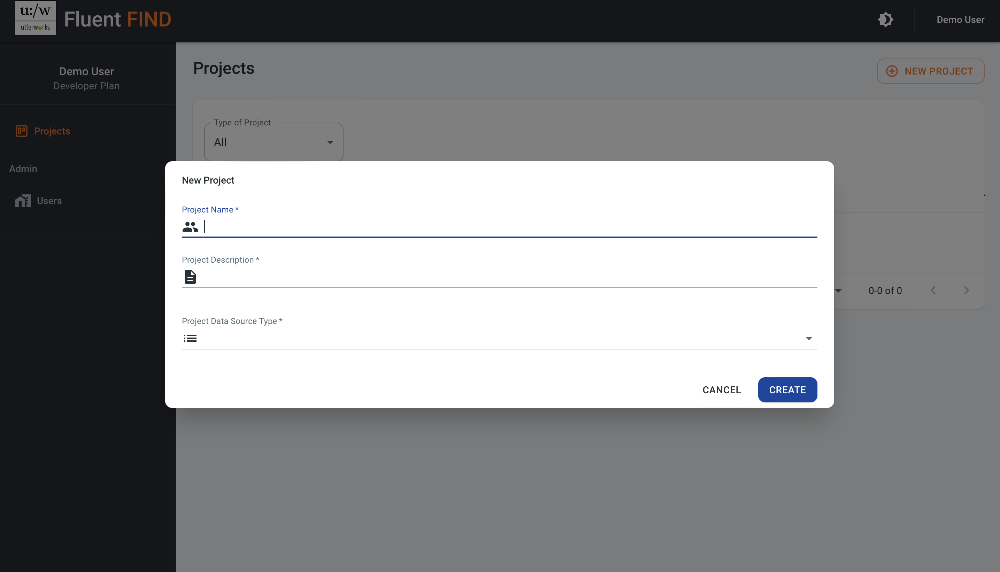

# Create a Search App Project
From the landing page, select Indexes from the menu bar top right to get started
 
Create a new search app project using the add new project buttom

Enter an app project name with no spaces (10 characters, a mix of lowercase letters, numbers and hyphens are allowed - this will be the reference used for the app in the API). Next, provide a meaningful title, and then select the source for the content to be indexed. This can be either a website (to crawl or configure a sitemap), or an AWS S3 bucket.

