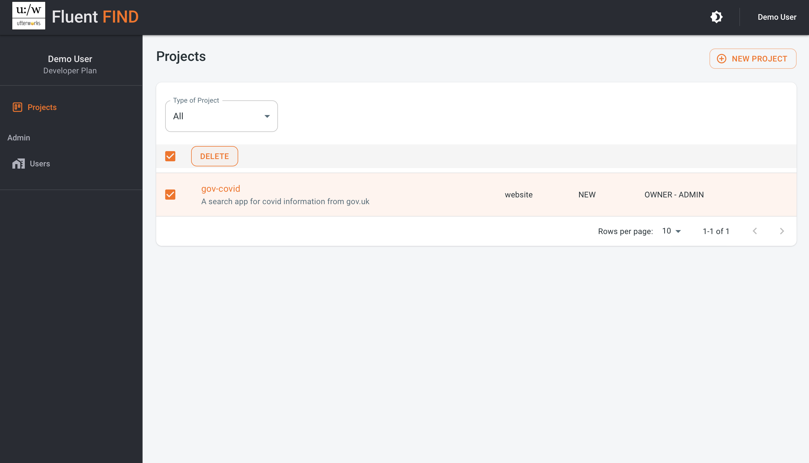

# Create a Search Project
From the landing page as a signed in user, select Indexes from the menu bar top right to get started

 

Create a new search project using the (+) NEW PROJECT buttom

Enter a project name..  
>The name should be a max of 10 characters - with no spaces, a mix of lowercase letters, numbers and hyphens are allowed - this name will form part of the API url.

Next, provide a meaningful description, and then select the source for the content to be indexed. This can be either a website (to crawl or configure a sitemap), or an AWS S3 bucket.

Once all the information is provided, use the Create button to create the new project. You'll then be taken to the projects view where you'll see the new project alongside any existing projects

## Delete a Project

Projects (and all their data) can be deleted from within the projects view. Select the project and use the DELETE option, accept the warning to complete the delete. Only an Administrator of a project can delete it

::: warning
Deleting a project can't be undone
:::

