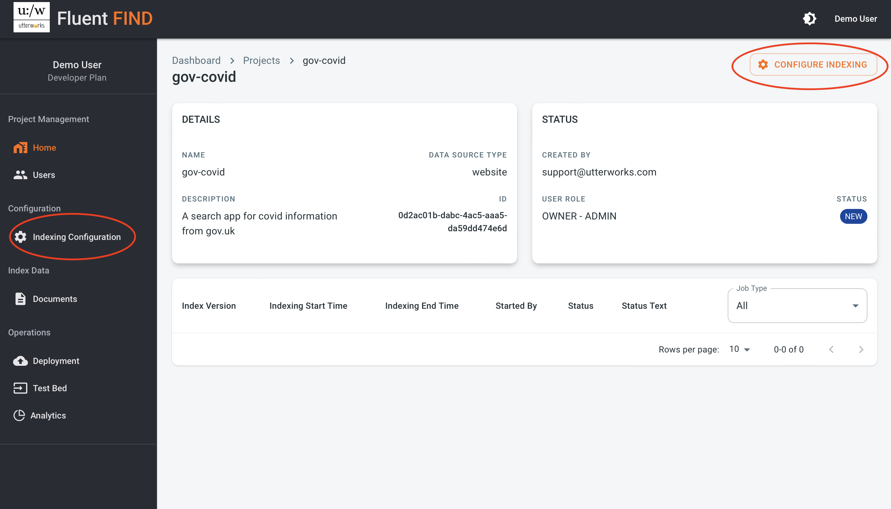
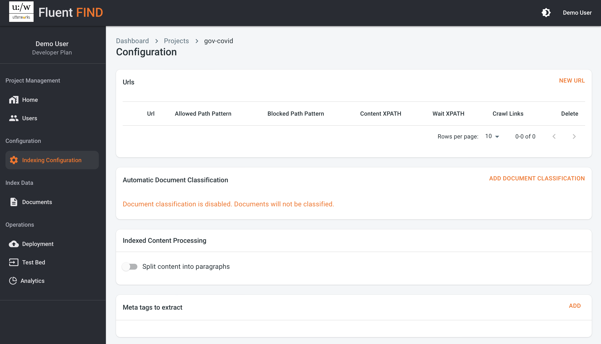
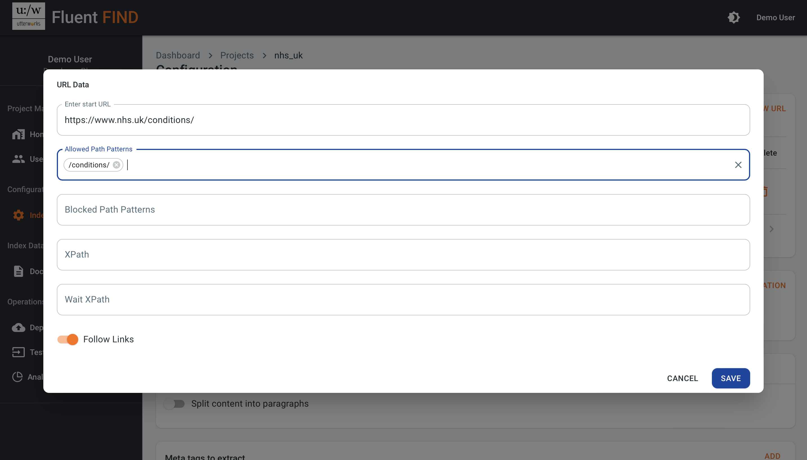
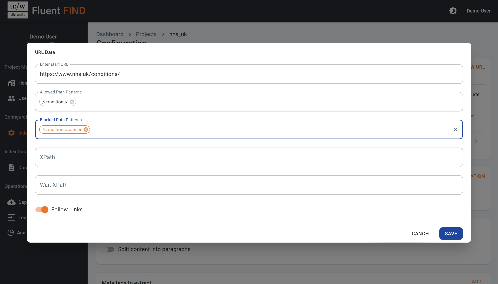

# Configure a website project
In the projects view, clicking on the project name takes you to the project configuration.

## Index Configuration

The first step in setting up a new project is to configure the source of the content to be included in the search project - we call this the index. The index configuration is a view on the left hand project navigation control, or if the project is new and hasn't yet had an index configured there is a CONFIGURE INDEXING button top right

### URLs

#### Start URL
With a website search project the start url provides the root of the indexing job. This could be a specific url, or it could be a sitemap xml document that represents some or all of the content on the website. The domain (e.g. the example.com portion of the start url) controls the main scope of the indexing job. Only content in the same domain will be indexed. If you want to capture content from several domains then multiple urls can be configured in the same project. 
::: tip
To configure a sitemap as a starting url use the full path to the sitemap e.g. www.example.com/sitemap.xml
:::

#### Allowed Path Patterns
The allowed path pattern is a way of refining the content the indexer chooses to index. When this is set, the indexer will evaluate the url path of the document being processed. If the url contains a match to the allowed path pattern the content will be extracted and indexed, if the url does not contain a pattern match the content will be ignored. If the allowed path is left blank, all content is extracted and indexed (unless it matches any blocked path pattern). Multiple allowed path ptterns can be set and content that matches any one of these will be extracted. 
::: tip
Individual path entries in the configuration are only recognised if you hit return once they are entered - they are then displayed as individual entries
:::

#### Blocked Path Patterns
The blocked path pattern can be used to explicitly ignore content matching a certain pattern. Blocked path patterns are evaluated after allowed paths, so any content matching a blocked path will be ignored regardless of whether it matches an allowed path or not. Multiple blocked path patterns can be set or it can be left blank.  

#### XPath
The indexer uses Machine Learning to infer what the most appropriate / primary content of a page or paragraph is, but sometimes this doesn't identify the content correctly. The XPath config parameter can be uesd to specifically instruct the indexer to extract content that matches the XPath. 

#### Wait XPath
Sometimes the content to be indexed is dynamically rendered at the point a page is loaded and so can be missed by the speed the indexer usually extracts content. Setting a waif XPath causes the indexer to wait until the content at a particular XPath has fully rendered before extraction. 

#### Follow Links
The follow links option tells the indexer to crawl all links on a page being indexed to pull in any additional content. This is typically set to True for a simple indexing configuration that might use a home page as the index starting url. If the index is based on one or more sitemaps, it is possible to index only content that appears explicitly in the sitemap by setting the follow links parameter to False

### Automatic Document Classification
The Find service includes the ability to automatically give indexed content a classification based on a list of provided labels. This uses a process called Zero Shot classification and is unsupervised, as documents are indexed a classifier determines which of the provided classifications best fits the content. 
::: tip
The accuracy of zero shot classification is improved by making the labels as meaningful and distinct as possible
:::
### Indexed Content Processing
An index can be configured to index content by pages, or if the "split content into paragraphs" option is selected, the content is indexed at the paragraph level. Paragraph indexing increases the granularity of the search results, but can sometimes lose context that is inferable for the full page content.

### Meta Tags to extract
If your content is already categorised (perhaps by your CMS), adding the tags that contain this information in this section means those tags will be extracted, stored, and retrieved as context for the indexed content - this can be useful for faceted search

