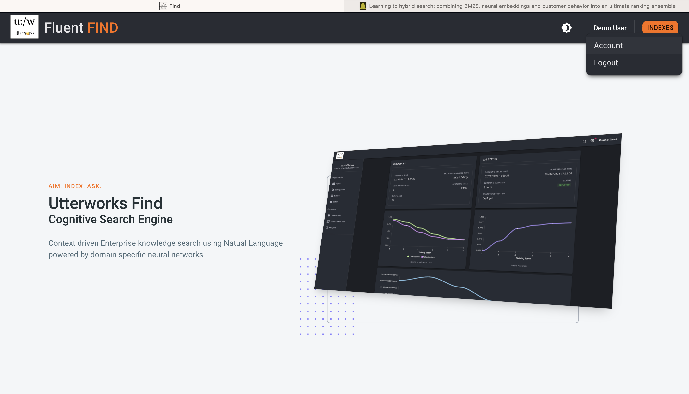
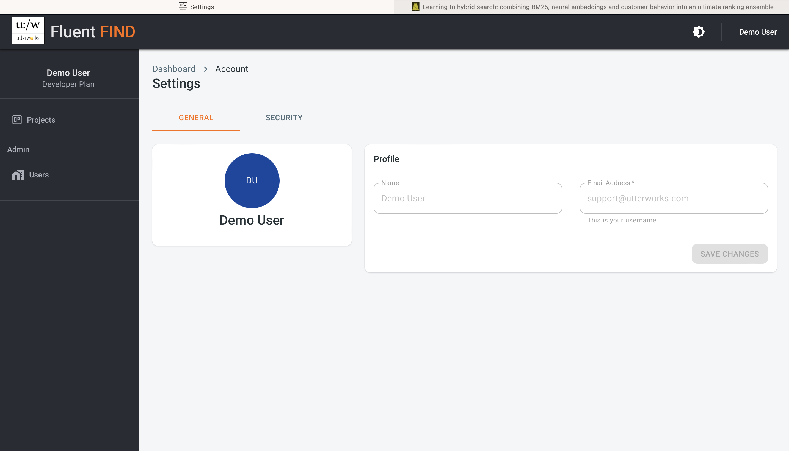
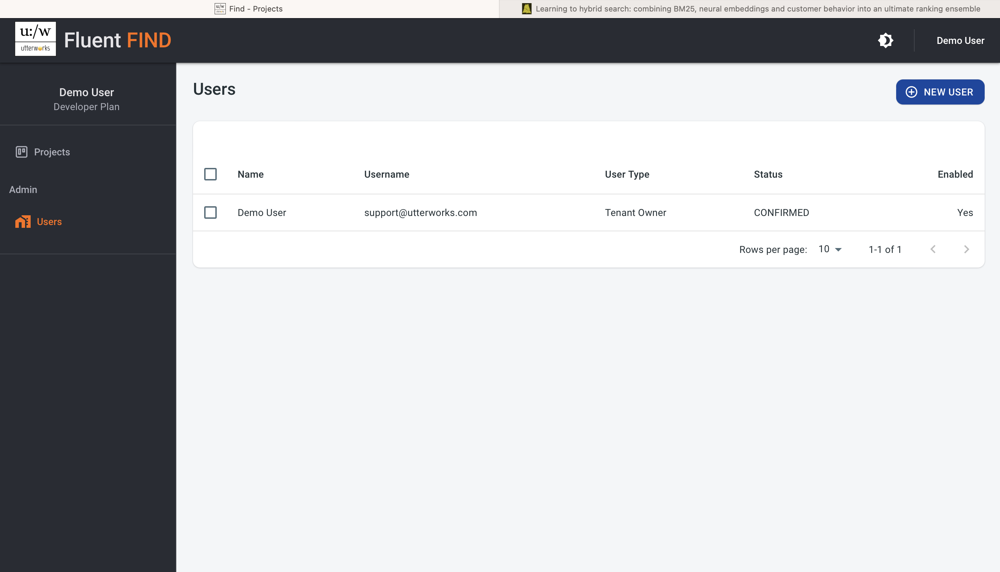
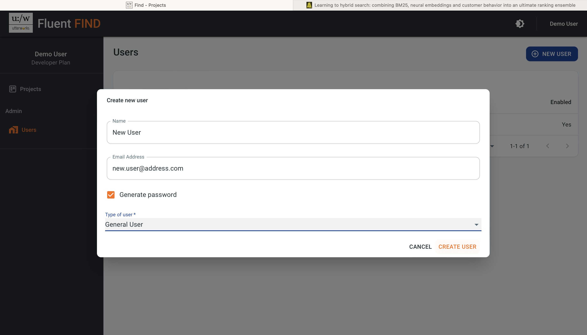

# User Management

## Account Users

To manage users on a specific project they must first be set up as users on the account / tennancy. Users are added through account settings which are accessed from the main landing page by clicking on the user name and selecting Account

This takes you to the Account Settings view

::: tip
The Account Settings are only accessible to users who are Administrators
:::

### Add New Account Users

Within Account Settings use the Users navigation control on the left pannel to access User Administration

The (+) NEW USER launches the dialog to create a new user

Enter the user name and a valid email address for the user. Then either create a password for the user or have one automatically generated. In either case the user will be required to change password on first login. Select whether the user will be a general user, or an account administrator. Then CREATE USER and the new user will receive an email with their temporary login credentials from admin@utterworks.com. Once they have signed in and changed their password they will appear in project user admin and can be assigned access to projects
::: tip
General users can still be made administrators on individual projects. Account administrators have the ability to add other account users. There always has to be at least one account administrator.
:::

## Project Users

Project user administration is accessed from the users section in the left hand control

### Add New Project Users

Select ADD USER in the top right to add a user to the project. Through this dialog you can search through the users already set up in your account and add them to individual projects. New users can be added with either a read only or an admin role for the project.

### Remove Project Users

To remove a user from a project, simply select the check box next to the user and use the REMOVE USER option. 
::: warning
The project OWNER-ADMIN cannot be removed
:::

### Change User Role

To change the role of a user on a project (e.g. from read only to Admin) the user should be deleted and then re-added with the desired role