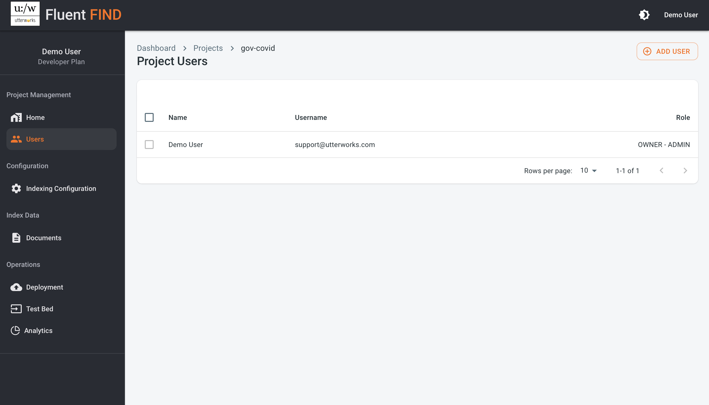
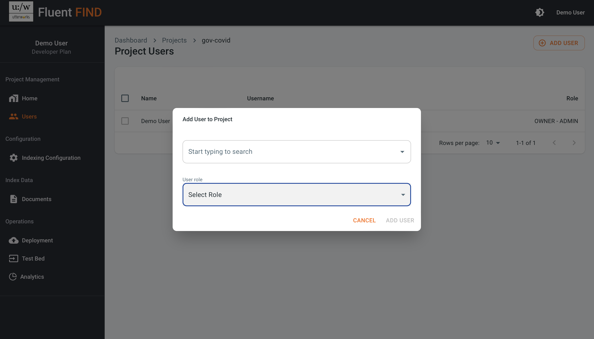
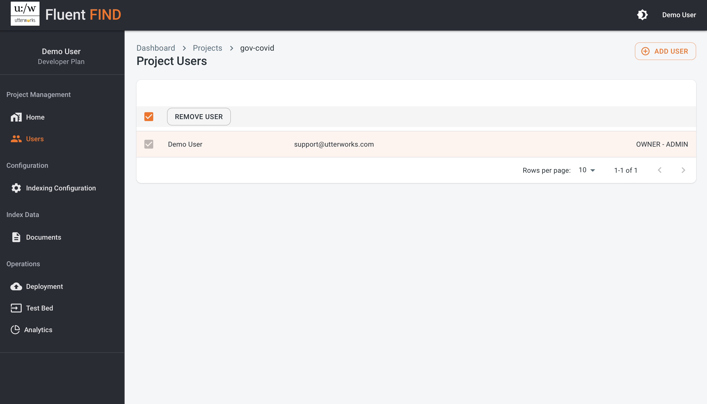

# User Management

## Account Users

To manage users on a specific project they must first be set up as users on the account / tennancy 

## Project Users

Project user administration is accessed from the users section in the left hand control

### Add New Project Users

Select ADD USER in the top right to add a user to the project. Through this dialog you can search through the users already set up in your account and add them to individual projects. New users can be added with either a read only or an admin role for the project.

### Remove Project Users

To remove a user from a project, simply select the check box next to the user and use the REMOVE USER option. 
> The project OWNER-ADMIN cannot be removec

### Change User Role

To change the role of a user on a project (e.g. from read only to Admin) the user should be deleted and then re-added with the desired role