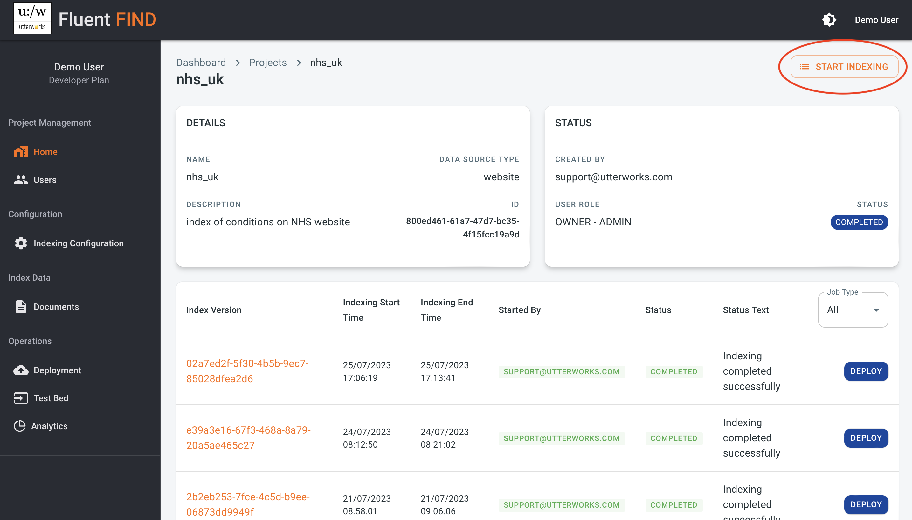
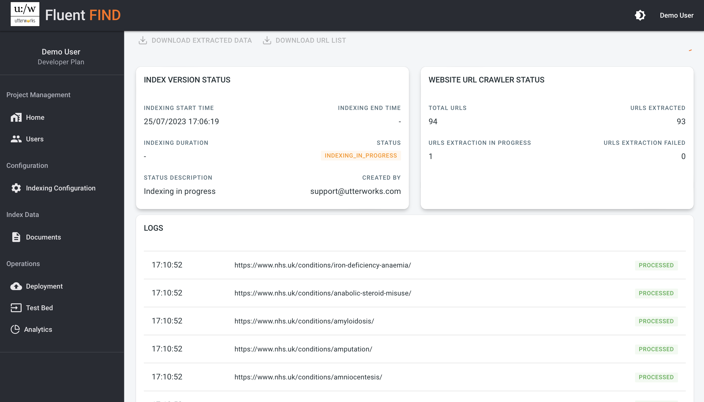
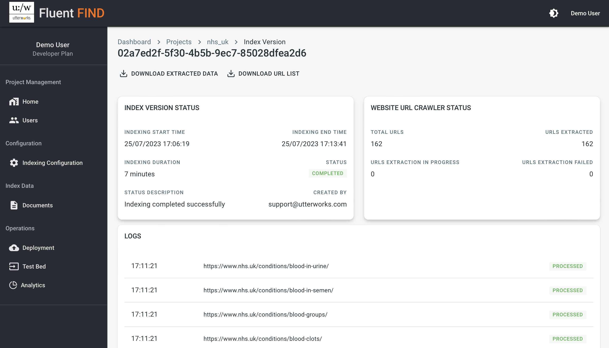
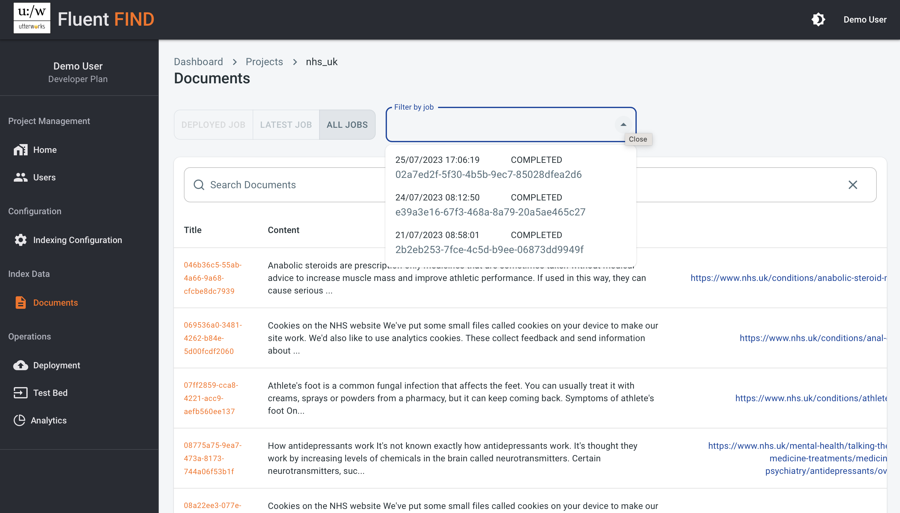
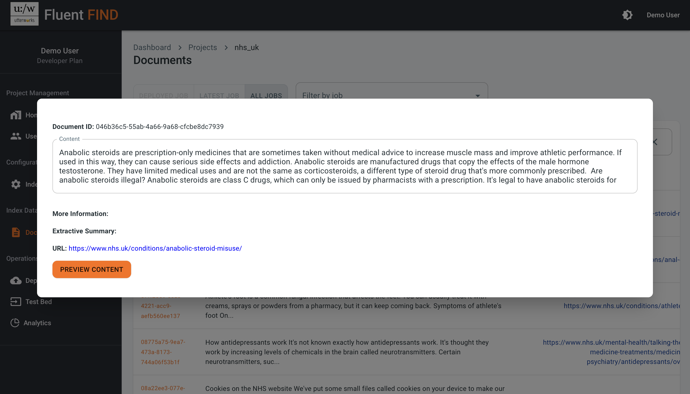
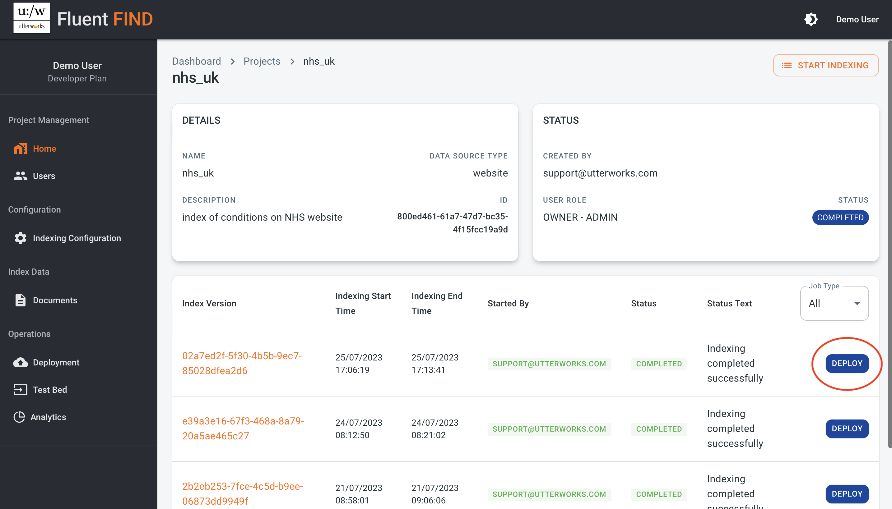
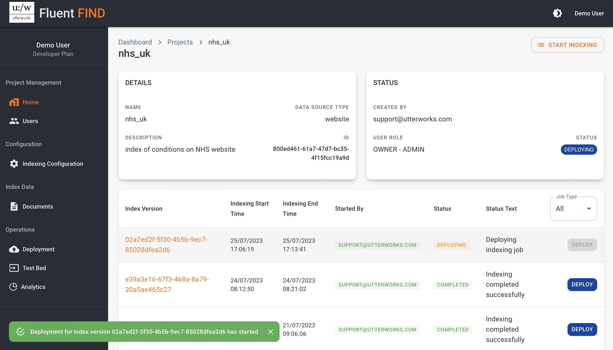

# Index and Deploy

## Start an Indexing Job

Once the indexing configuration has been created an Indexing job can be started. From the prject Home view the START INDEXING button is available in the top right.

### Monitor Job Progress

Clicking on the Index Version Id takes you through to the details page for the Index job. While the job is running the job status is updated as urls are processed by the indexer. The  
status shows the number of urls processed in total and a count of those that have been successfully processed and a count of any that have failed to process.

Once the Index job is complete the status is updated to reflect this with the final counts of urls indexed. There are also links that become active to allow the download of the list of the urls indexed for reference, and to download the actual extracted content.

### Review Index Data

As well as downloading the list of urls and a csv of the indexed documents there is a Documents view in the Project navigation. From this view documents from any index version can be viewed. There are pre filters to review documents from the latest index, or from the currently deployed index. It is also possible to select any other index version from the ALL JOBS pre-filter and selecting the specific indexing job

Clicking on the unique identifier for the document opens the detail view where all the details associated with the document can be reviewed.

## Deploy an Index

Once an indexing job has been completed successfully and when you are happy with the content, the index can then be deployed to make it available for searching via the API. From the project home choose the deploy button on the right of the index version that you wish to deploy.

After a moment the deployment will start

## Schedule automatic Indexing